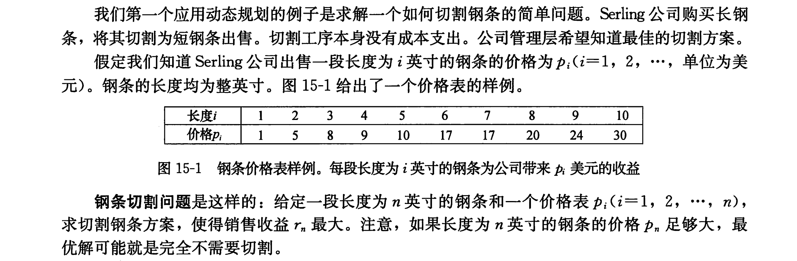
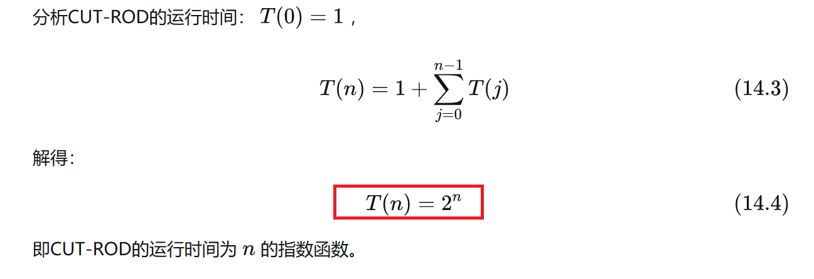
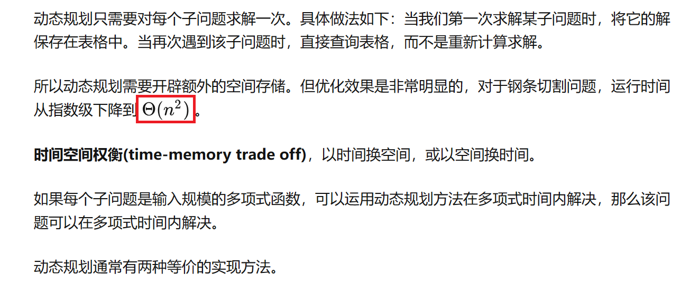
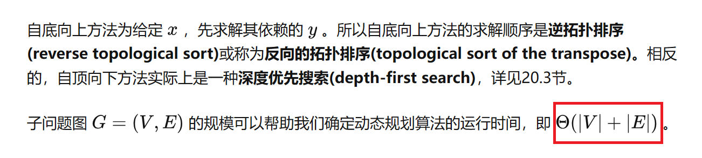
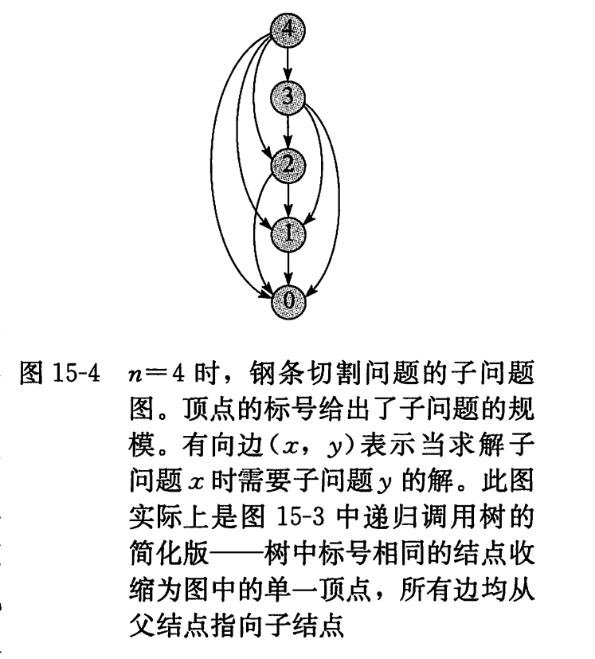

<h2 align="center">算法导论笔记</h2><hr/>

> 其中1-14章的内容在《数据结构》这本书中已经涵盖,此处从15章开始整理。

[[返回主页]](http://ai.inetgeek.cn)

-------------

## 代码参考

- **GitHub**：[500个常用数据结构，算法，算法导论](https://github.com/0voice/algorithm-structure)
- **CSDN**：[KeepCoding♪Toby♪_LeetCode刷题,算法导论](https://blog.csdn.net/m0_61843614?type=blog)
- **WiKi**：[OI Wiki - OI Wiki](https://oi.wiki/)
- **GitHub**：[MaoMao-zk/Introduction-to-Algorithms: 学习《算法导论》](https://github.com/MaoMao-zk/Introduction-to-Algorithms)
- **知乎**：[算法导论（第四版）自学笔记](https://zhuanlan.zhihu.com/p/536470404)

----------------------

## 15章 动态规划

### 15.1 钢条切割

> [【Python算法系列】动态规划6-钢条切割问题_哔哩哔哩_bilibili](https://www.bilibili.com/video/BV1oU4y1r7gF/?spm_id_from=333.1007.top_right_bar_window_custom_collection.content.click&vd_source=53a8c726503d3ac9f6d68911fe515164)



长度为 n 英尺的钢条一共有 $2^{n-1}$ 种切法，一般在距离钢条左端 $i(i-1,2,\cdots,n)$ 寸处，总可以选择切割或者不切。

**最优子结构**：


#### 1.递归（自顶向下）求解

> 算法思路：

```python
CUT-ROD(p, n)
    if n == 0
        return 0
    q = -∞
    for i = 1 to n
        q = max{q, p[i] + CUT-ROD(p, n - i)}
    return q
```


<u>（图为n=4时的递归树，最大利润的切割为4=2+2，r=5+5=10）</u>

采用递归的方式遍历每一种可能，并从树根取每种可能的每一层的最大值（即每种路径中最大值），此方式掉率很低。

> 时间复杂度



#### 2.动态规划求解




（1）**带备忘的[自顶向下]()法**：

此方法仍按自然的递归形式编写过程，但过程会保存每个子问题的解(通常保存在一个数组或散列表中)。当需要一个子问题的解时，过程首先检查是否已经保存过此解。如果是，则直接返回保存的值，从而节省了计算时间;否则，按通常方式计算这个子问题。我们称这个递归过程是带备忘的(`memoized`)。因为它“记住”了之前已经计算出的结果。

> 算法

```pascal
MEMORIZED-CUT-ROD(p,n)
let r[0...n] be a new array
for i = 0 to n	//新建一个存储的数组
	r[i] = -∞
return MEMORIZED-CUT-ROD-AUX(p,n,r)

MEMORIZED-CUT-ROD-AUX(p,n,r)
if r[n] >= 0	//检查所需的值是否已知
	return r[n]
//计算所需值q	
if n==0	
	q = 0
else q = -∞
	for i = 1 to n
		q = max(q,p[i]+MEMORIZED-CUT-ROD-AUX(p,n-i,r))
r[n] = q		//将q存入r[n]
return q
```

> 代码

```c++
int memorizedCutRodAux(int p[], int n, int r[])
{
    int q;//最大收益值
    if (r[n] >= 0)
        return r[n];//检查所需值是否已知
    if (n == 0)
        q = 0;//n=0时不会有收益
    else
    {
        q = -1;
        for (int i = 0; i < n; ++i) //求解每一层最大值
            q = max(q, p[i] + memorizedCutRodAux(p, n - i - 1, r));
    }
    r[n] = q; //保存每一层最大值
    return q;
}

int memorizedCutRod(int p[], int n)
{
    int *r = new int(n+1);
    for (int i = 0; i <= n; ++i)
        r[i] = -1;
    return memorizedCutRodAux(p, n, r);
}
```

（1）**自底向上法**：

这种方法一般需要恰当定义子问题“规模”的概念，使得<u>任何子问题的求解都只依赖于“更小的"子问题的求解</u>。<u>因而我们可以将子问题按规模排序，按由小至大的顺序进行求解。</u>当求解某个子问题时，它所依赖的那些更小的子问题都已求解完毕，结果已经保存。每个子问题只需求解一次， 当我们求解它(也是第一次遇到它)时， 它的所有前提子问题都已求解完成。

> 算法

```pascal
BOTTOM-UP-CUT-ROD(p, n)
    let r[0 : n] be a new array    // will remember solution values in r
    r[0] = 0
    for j = 1 to n    // for increasing rod length j
        q = -∞
        for i = 1 to j    // i is the position of the first cut
            q = max{q, p[i] + r[j - i]}
        r[j] = q    // remember the solution value for length j
    return r[n]
```

> 代码

```c++
int BottomUpCutRod(int p[], int n)
{
    int* r = new int(n + 1); //申请存储中间结果的数组表，打表
    r[0] = 0;
    if (n == 0) {
        return 0;
    }
    for (int j = 1; j <= n; j++) {
        int q = INT_MIN; //类似于负无穷，q用于存储此次的最大利益
        for (int i = 1; i <= j; i++) {	//第一次切割的地方
            q = max(q, p[i-1] + r[j - i]);
        }
        r[j] = q;
    }
    return r[n];
}
```



#### 3.子问题图



#### 4.重构解

过程MEMOIZED-CUT-ROD和BOTTOM-UP-CUT-ROD只返回了最优解的值，但并未返回最优解本身（切割后每段钢条的长度列表），我们利用扩展动态规划算法，对每个子问题不仅保留最优解的**值(value)**，还保留对应的最优解的**选择(choice)**方案，利用这些信息，就能够输出最优解。BOTTOM-UP-CUT-ROD的扩展版EXTENDED-BOTTOM-UP-CUT-ROD的伪代码如下：

```pascal
EXTENDED-BOTTOM-UP-CUT-ROD(p, n)
    let r[0 : n] and s[1 : n] be a new array
    r[0] = 0
    for j = 1 to n    // for increasing rod length j
        q = -∞
        for i = 1 to j    // i is the position of the first cut
            if q < p[i] + r[j - i]
                q = p[i] + r[j - i]
                s[j] = i    // best cut location so far for length j
        r[j] = q    // remember the solution value for length j
    return r and s
```

最后输出完整的切割方案，PRINT-CUT-ROD-SOLUTION的伪代码如下：

```pascal
PRINT-CUT-ROD-SOLUTION(p, n)
    (r, s) = EXTENDED-BOTTOM-UP-CUT-ROD(p, n)
    while n > 0
        print s[n]    // cut location for length n
        n = n - s[n]    // length of the remainder of the rod
```

----------

### 15.2 矩阵链乘法


